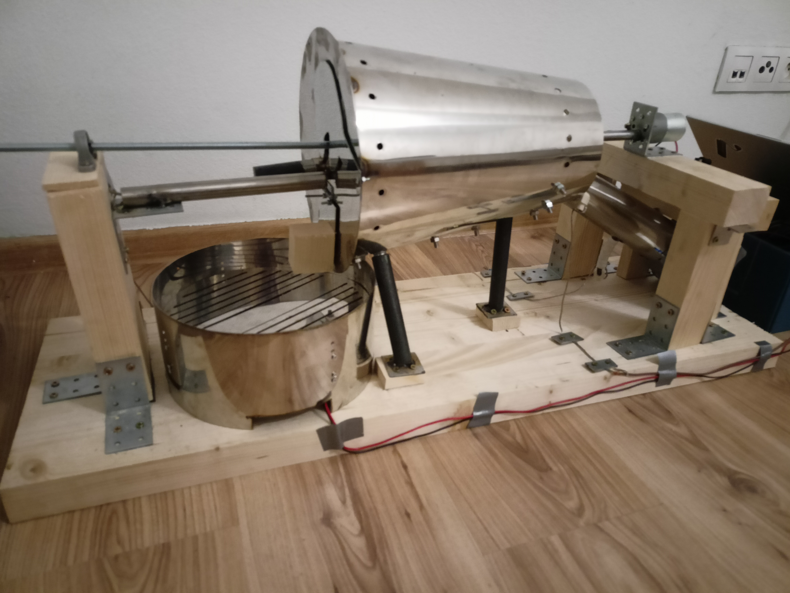
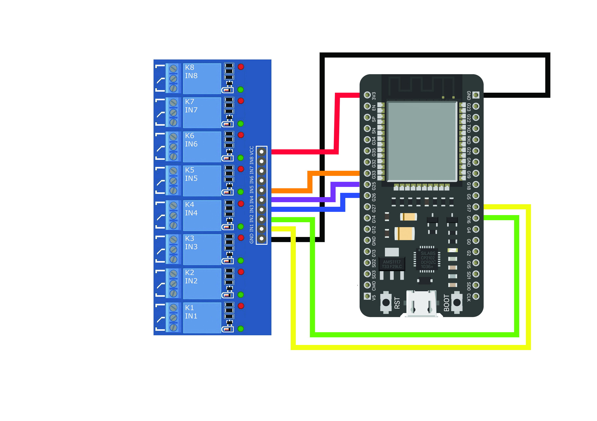
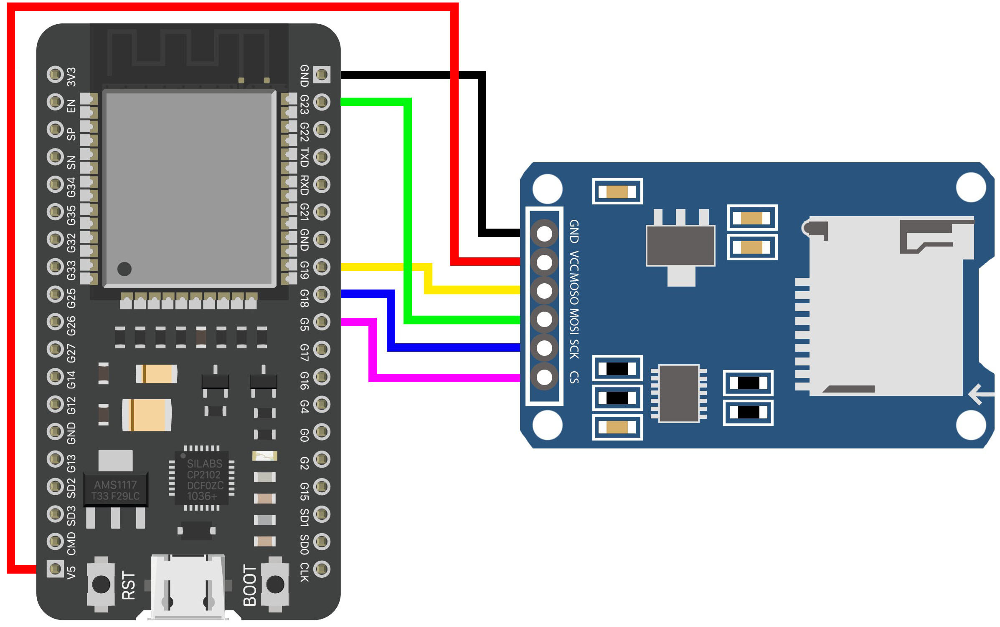
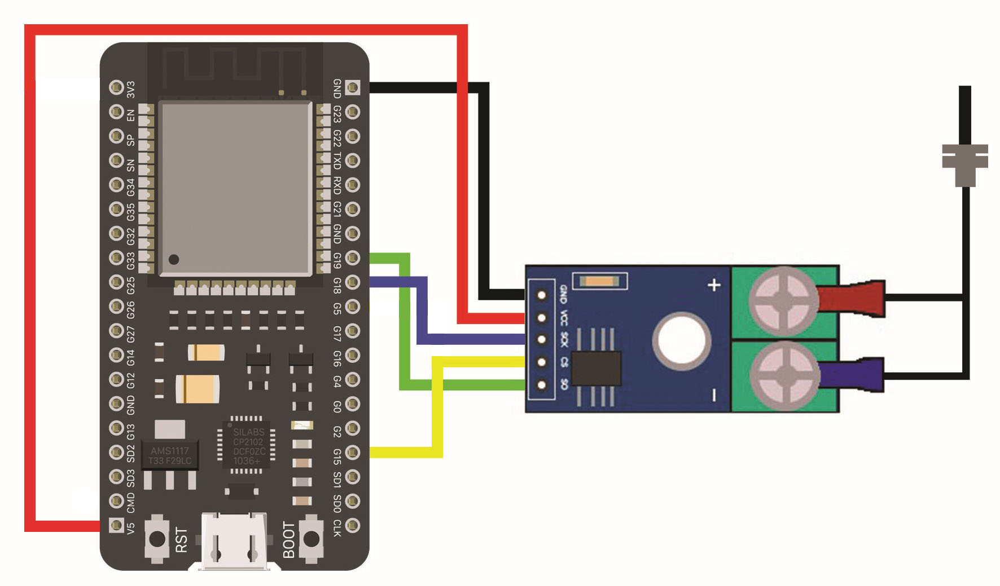
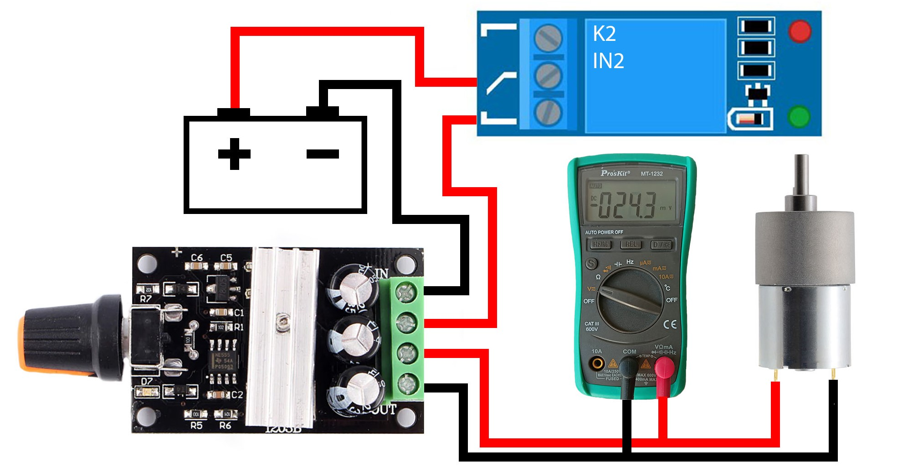

# Coffee roaster

## Roaster

## Relay_8 - connection to ESP32-DevKitC

## Reader_SD - connection to ESP32-DevKitC

## Max_6675 - connection to ESP32-DevKitC

## Engine with PWM regulator - connection to ESP32-DevKitC

